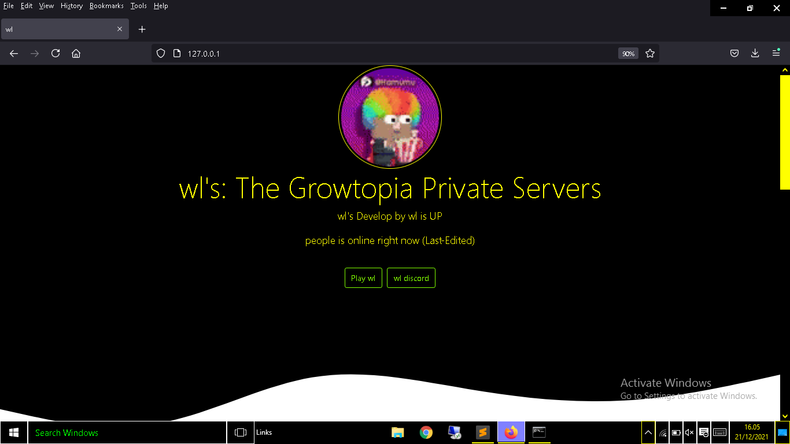

# your-http sources-code
- [Features](https://github.com/FrenzY8/your-http/blob/main/README.md#features)
- [Previews](https://github.com/FrenzY8/your-http/blob/main/README.md#previewofhttp)
- [Files-Editing](https://github.com/FrenzY8/your-http/blob/main/README.md#editing-the-source)
- [Change-Logs](https://github.com/FrenzY8/your-http/blob/main/README.md#httpchange-logs)
- [Installations](https://github.com/FrenzY8/your-http/blob/main/README.md#installations)

# preview of http
<p align="center">

<a align="center">
 
> Explanations
  - ```wl```'s will replaced to your servers name
  - ```develop by wl``` will replaced with your names
  - ```people onlines right now``` will replaced into your online-player.
  
# features
 > all of them is the features!
 - OTP Code
 - Json Saving
 - Custom Items Reader
 - Custom HTML
 - Login-Signup-Logout System
 - Auto-Save
 - Auto-Save and Countinue System
 
> All ```System``` code has been Open Sourced in [My Github](https://github.com/FrenzY8)
 
# editing the sources
> webhook.json
- ```Some explanations:```
-  Normal webhook is: 
  - https://discordapp.com/api/webhooks/xxxxxxxxxxxxxxxxxxx/xxxxxxxxxxxxxxxxxxxxxxxxxxxxxxxxxxxxxxxxxxxxxxxxxxxxxxxxxxxxxxxxxxxx
> Now editing:  
  - ```"headerWeb": "https://discordapp.com/api/"``` dont replace
  - ```"bodyWeb": "webhooks/xxxxxxxxxxxxxxxxxxx/"``` 'xxxxxxxxxxxxxxxxxxx' is your channel id
  - ```"tokenWeb": "xxxxxxxxxxxxxxxxxxxxxxxxxxxxxxxxxxxxxxxxxxxxxxxxxxxxxxxxxxxxxxxxxxxx"``` your token/last link webhooks
  
# installations
  > Copy all of them below and put into your ```CMD.exe```
  - npm i console-title
  - npm i cryptr
  - npm i discord-webhook-node
  - npm i express-rate-limit
  - npm i gradient-string
  - npm i limiter
  - npm i random-username-generator
  
# avoid crashing
  - you need to put into your servers source, why?
  - 1. we need count your online player
  - 2. we need to read your interface folder (if ```GTOS``` sources)
  - 3. we need to post all of them to your ```HTTP```
  
# contact me!
  - look at banner in my readme.md or [click here](https://github.com/FrenzY8) to see my discord accounts and Tag.
  
# any-bug? crashing? will be writted in _your.http_error.txt

# http change-logs
 Version: 4.7.0
  - Updated Bootstrap to version 5.1.3
  - Updated all outdated third party vendor libraries to their latest versions

Version: 4.6.0
  - Updated Bootstrap to version 5.1.2
  - Updated all outdated third party vendor libraries to their latest versions

Version: 4.5.0
  - Fixed slider issue in testimonials and portfolio details sections

Version: 4.4.0
  - Updated Bootstrap to version 5.1.1
  - Updated all outdated third party vendor libraries to their latest versions
  - Improved and updated dev version gulp scripts

Version: 4.3.0
  - Updated Bootstrap to version 5.0.1
  - Updated all outdated third party vendor libraries to their latest versions
  - Fixed navigation links focus color

Version: 4.2.0
  - Updated Bootstrap to version 5.0.0 Final
  - Updated all outdated third party vendor libraries to their latest versions

Version: 4.1.0
  - Updated Bootstrap to version 5.0.0-beta3
  - Updated all outdated third party vendor libraries to their latest versions
  - Updated the PHP Email Form to V3.1

Version: 4.0.1
  - Updated Bootstrap to version 5.0.0-beta2
  - Updated all outdated third party vendor libraries to their latest versions

Version: 4.0.0
  - The template does not require jQuery anymore
  - Removed jQuery and all the jQuery plugins
  - The assets/js/main.js was rewritten completely with vanilla Javascript. No more jQuery code
  - Restructured the dev version for better development experience
  - Updated the PHP Email Form to V3.0 - No jQuery dependency. Added attachment support

Version: 3.0.0
  - Initial release with Bootstrap v5.0 Beta 1

Version: 2.2.0
  - Updated Bootstrap to version 4.5.3
  - Updated all outdated third party vendor libraries to their latest versions
  - Updated the PHP Email Form to v2.3
  - Other small fixes and improvements

Version: 2.1.0
  - Updated Bootstrap to version 4.5.0
  - Updated the PHP Email Form library to version 2.0 with reCaptcha support
  - Aded inner-page.html tempalte
  - Added smooth scroll on page load with hash links in the url
  - Updated all outdated third party vendor libraries to their latest versions
  - Other small fixes and improvements
  
Version: 2.0.0
  - The template was rebuilt from scratch with the latest Bootstrap version (4.4.1)
  - Added SMPTP support for the contact form script (Pro)
  - Added NodeJS NPM Development version (Pro unlimited & Membership members)
  
Version: 1.0.0
- Initial Release
